# Portale Pazienti - Backend

NestJS backend for the Portale Pazienti project, using PostgreSQL (via Knex) and Swagger for API documentation.

## Prerequisites

- Node.js 20+
- npm
- Docker & Docker Compose

## Environment variables

Create a `.env` file in the project root with the following structure:

```env
# General
PP_LOADED_ENV=Development          # Environment label (Development, Production, ...)

# Docker container names
PP_DB_CONTAINER_NAME=pp_db           # Name for the PostgreSQL container
PP_BE_CONTAINER_NAME=pp_be           # Name for the backend container

# PostgreSQL connection
PP_PG_DB=portale_pazienti            # Database name
PP_PG_USER=exaMantainer              # Database user
PP_PG_PASS=pass123%                  # Database password
PP_PG_HOST=localhost                 # Host (use "localhost" for local dev, "db" is set automatically in Docker)
PP_PG_PORT=5433                      # Exposed port on the host (maps to 5432 inside the container)

# Auth / Security
PP_BE_SECRET=<your_jwt_secret>       # JWT secret key
PP_BE_SALT=<your_bcrypt_salt>        # Bcrypt salt
PP_SALT_RNDS=10                      # Bcrypt salt rounds
```

> When running via `docker-compose`, `PP_PG_HOST` is overridden to `db` (the service name) and `PP_PG_PORT` is set to `5432` internally. The `.env` values are only relevant for local development.

## Project setup

```bash
npm install
```

## Local startup

Start the database first, then run the backend:

```bash
# 1. Start the DB container and run pending migrations
npm run db-start

# 2. Start the backend in watch mode
npm run start:dev
```

The API will be available at `http://localhost:3000`.

### Other start modes

```bash
npm run start          # standard mode
npm run start:dev      # watch mode (auto-reload on changes)
npm run start:debug    # debug mode (with --inspect-brk)
npm run start:prod     # production mode (requires a prior "npm run build")
```

## Docker

### Full stack with Docker Compose

`docker-compose up` spins up two services:

| Service | Image            | Description                                           |
| ------- | ---------------- | ----------------------------------------------------- |
| `db`    | `postgres:14.17` | PostgreSQL database with init scripts from `db/*.sql` |
| `be`    | `node:20`        | NestJS backend in watch mode                          |

```bash
# Build and start both containers
docker-compose up --build -d

# Stop and remove containers + images
npm run db-stop        # alias for: docker-compose down --rmi all
```

- The DB data is persisted in a named volume (`pp-db-volume`).
- The containers are connected via the `pp-network` Docker network.
- The DB is exposed on the host at port **5433** (mapped from 5432 inside the container).
- The backend is exposed at port **3000**.

### db-start script

`npm run db-start` executes `scripts/db-start.sh`, which:

1. Runs `docker-compose up --build -d` to start all containers.
2. Waits for the DB container to be ready.
3. Checks for pending Knex migrations and runs them if needed.

This is the recommended way to start the database for local development.

## Database & Migrations

The project uses **Knex** as a query builder and migration tool, configured in [knexfile.ts](knexfile.ts).

Migration files are located in the `migrations/` directory.

### Available commands

```bash
# Generate a new migration file
npm run migration:generate -- <migration_name>

# Check migration status
npm run migration:status

# Run all pending migrations
npm run migration:migrate
```

### Database schema

The initial schema is created by `db/01-init.sql` on first container startup. Subsequent changes are handled by Knex migrations.

```mermaid
erDiagram
    role {
        serial id PK
        varchar description
        jsonb auth_list
    }

    field {
        serial id PK
        varchar description
    }

    status {
        serial id PK
        varchar description
    }

    day {
        serial id PK
        varchar description
    }

    document {
        serial id PK
        varchar path
        boolean deleted
        timestamp created_at
        timestamp updated_at
        timestamp deleted_at
    }

    specialist {
        serial id PK
        integer id_role FK
        boolean deleted
        varchar cod_fisc
        varchar first_name
        varchar last_name
        varchar email
        varchar cap
        varchar city
        varchar state
        varchar address
        varchar p_iva
        date birth_date
        varchar sex
        varchar phone
        varchar title
        varchar specialization
        varchar clinic_name
        varchar clinic_cap
        varchar clinic_city
        varchar clinic_address
        varchar clinic_phone
        point clinic_coords
        timestamp created_at
        timestamp updated_at
        timestamp deleted_at
    }

    patient {
        serial id PK
        integer id_role FK
        boolean deleted
        varchar first_name
        varchar last_name
        varchar email
        varchar cap
        varchar city
        varchar state
        varchar address
        varchar cod_fisc
        date birth_date
        varchar birth_place
        varchar sex
        varchar phone
        timestamp created_at
        timestamp updated_at
        timestamp deleted_at
    }

    bo_operator {
        serial id PK
        integer id_role FK
        integer id_field FK
        boolean deleted
        varchar first_name
        varchar last_name
        varchar email
        timestamp created_at
        timestamp updated_at
        timestamp deleted_at
    }

    opening_schedule {
        serial id PK
        integer id_day FK
        integer id_specialist FK
        boolean deleted
        time opening_morning
        time closing_morning
        time opening_afternoon
        time closing_afternoon
        integer slot_size_minutes
        timestamp created_at
        timestamp updated_at
        timestamp deleted_at
    }

    appointment {
        serial id PK
        integer id_patient FK
        integer id_specialist FK
        integer id_status FK
        date date
        time time_start
        time time_end
        text notes
        boolean deleted
        timestamp created_at
        timestamp updated_at
        timestamp deleted_at
    }

    request {
        serial id PK
        integer id_status FK
        integer id_operator FK
        boolean deleted
        varchar nature
        timestamp created_at
        timestamp updated_at
        timestamp deleted_at
    }

    health_service {
        serial id PK
        integer id_specialist FK
        integer id_patient FK
        integer id_request FK
        integer id_document FK
        boolean free_service
        date date
        text report
        integer pregnancy_month
        integer pregnancy_week
        integer teeth_brushing_frequency
        boolean smoking
        boolean does_year_checkup
        boolean currently_ill
        jsonb current_illness
        boolean specific_diet
        boolean actively_reach_asl_out
        boolean missing_teeth
        integer missing_teeth_number
        jsonb missing_teeth_location
        boolean cavited_teeth
        integer cavited_teeth_number
        jsonb cavited_teeth_location
        boolean dental_prosthesis_or_implants
        integer dental_prosthesis_or_implants_number
        jsonb dental_prosthesis_or_implants_location
        boolean tartar
        integer tartar_number
        jsonb tartar_location
        boolean dental_plaque
        integer dental_plaque_number
        jsonb dental_plaque_location
        boolean in_need_of_treatment
        text notes
        timestamp created_at
        timestamp updated_at
        timestamp deleted_at
    }

    user_to_document {
        serial id PK
        integer id_patient FK
        integer id_specialist FK
        timestamp created_at
        timestamp updated_at
    }

    user_credential {
        serial id PK
        integer id_patient FK "nullable"
        integer id_specialist FK "nullable"
        integer id_operator FK "nullable"
        boolean active
        boolean deleted
        varchar email
        varchar password
        varchar password_recovery_token
        timestamp last_login_at
        timestamp registered_at
        timestamp created_at
        timestamp updated_at
        timestamp deleted_at
    }

    email_notification {
        serial id PK
        integer id_patient FK "nullable"
        integer id_specialist FK "nullable"
        integer id_operator FK "nullable"
        varchar type
        timestamp created_at
        timestamp updated_at
    }

    notification {
        serial id PK
        text description
    }

    sms_notification_reception_state {
        serial id PK
        varchar description
    }

    sms_notification_dispatch_error_state {
        serial id PK
        varchar description
    }

    sms_notification_dispatch_state {
        serial id PK
        varchar description
    }

    sms_notification_response {
        serial id PK
        varchar description
    }

    sms_notification {
        serial id PK
        integer id_patient FK
        integer id_sms_notification_reception_state FK
        integer id_sms_notification_dispatch_error_state FK
        integer id_sms_notification_dispatch_state FK
        integer id_sms_notification_response FK
        integer id_notification FK
        timestamp created_at
        timestamp updated_at
    }

    role ||--o{ specialist : "id_role"
    role ||--o{ patient : "id_role"
    role ||--o{ bo_operator : "id_role"
    field ||--o{ bo_operator : "id_field"

    day ||--o{ opening_schedule : "id_day"
    specialist ||--o{ opening_schedule : "id_specialist"

    status ||--o{ request : "id_status"
    bo_operator ||--o{ request : "id_operator"

    specialist ||--o{ health_service : "id_specialist"
    patient ||--o{ health_service : "id_patient"
    request ||--o{ health_service : "id_request"
    document ||--o{ health_service : "id_document"

    patient ||--o{ user_to_document : "id_patient"
    specialist ||--o{ user_to_document : "id_specialist"

    patient ||--o{ user_credential : "id_patient"
    specialist ||--o{ user_credential : "id_specialist"
    bo_operator ||--o{ user_credential : "id_operator"

    patient ||--o{ email_notification : "id_patient"
    specialist ||--o{ email_notification : "id_specialist"
    bo_operator ||--o{ email_notification : "id_operator"

    patient ||--o{ sms_notification : "id_patient"
    sms_notification_reception_state ||--o{ sms_notification : "id_sms_notification_reception_state"
    sms_notification_dispatch_error_state ||--o{ sms_notification : "id_sms_notification_dispatch_error_state"
    sms_notification_dispatch_state ||--o{ sms_notification : "id_sms_notification_dispatch_state"
    sms_notification_response ||--o{ sms_notification : "id_sms_notification_response"
    notification ||--o{ sms_notification : "id_notification"

    patient ||--o{ appointment : "id_patient"
    specialist ||--o{ appointment : "id_specialist"
    status ||--o{ appointment : "id_status"
```



### How migrations extend the schema

`db/01-init.sql` is executed once by Docker when the container is first created. It defines the baseline schema. All subsequent structural or data changes are handled by Knex migrations in the `migrations/` directory, which are applied in chronological order (by filename timestamp) via `npm run migration:migrate`.

| Migration file | What it does |
|---|---|
| `20250314140713_ghost_user` | Seeds ghost users (patient, specialist, bo_operator) and their credentials — used as safe placeholders in dev/test |
| `20250314145728_dictionary_tables` | Populates `day` (Mon–Sun) and `status` dictionary tables |
| `20260210150524_role_populate` | Seeds `operator` and `patient` roles |
| `20260224163503_dentist_role` | Seeds `specialist` role |
| `20260302154718_components_table` | Creates the `component` table for frontend module definitions |
| `20260306135542_module_agenda_3_4` | Seeds the `agenda` component (roles: patient, specialist) |
| `20260306140123_module_find_specialist_3` | Seeds the `find_specialist` component (roles: patient, specialist) |
| `20260306140415_module_medical_report_3_4` | Seeds the `medical_report` component (roles: patient, specialist) |
| `20260306140533_module_profile_1_2_3_4` | Seeds the `profile` component (all roles) |
| `20260306152953_components_extension` | Adds `label`, `icon`, and `order` columns to `component` and sets their values |
| `20260311080718_clinic_coords` | Adds the `clinic_coords` (`point`) column to `specialist` for geospatial queries |
| `20260311090000_specialists_seed` | Seeds ~400 specialist records across 40 Italian cities, their weekly `opening_schedule` entries, and a `user_credential` for each (password: `sonoUnaPasswordDiTest`) |
| `20260311095000_appointment_and_schedule_slot` | Adds `slot_size_minutes` to `opening_schedule`; creates the `appointment` table |

## Swagger

Swagger UI is automatically available when the app is running at:

```
http://localhost:3000/api
```

- Theme: **Nord Dark** (via `swagger-themes`)
- JWT authentication is supported: click the "Authorize" button in the Swagger UI and paste a valid Bearer token to test protected endpoints.
